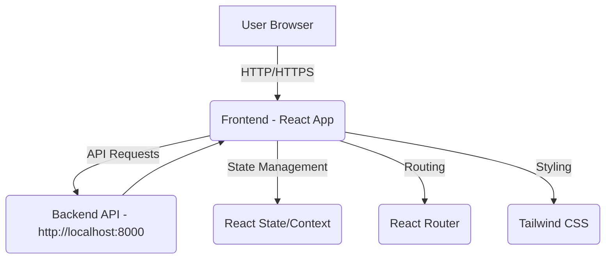

# 📱 CRM Frontend

Hey there! 👋 Welcome to the frontend part of our CRM Platform. We've built this with **React + Vite + Tailwind CSS** to give you a smooth and beautiful experience for managing your customer relationships.

## 🎯 What You Can Do

Here's what makes our frontend special:
- Sign in with your Google account in a snap
- View and manage your customers and their orders with ease
- Create smart customer segments using our intuitive rule builder
- Launch and track your marketing campaigns
- Get real-time insights from our dashboard
- Generate AI-powered messages for your customers
- Enjoy a beautiful interface that works perfectly on any device

## 🛠️ The Tech Behind the Magic

We've used some awesome tools to build this:
- React.js with Vite for lightning-fast development
- Tailwind CSS for beautiful, responsive designs
- React Router for smooth navigation
- Google OAuth for secure sign-in
- OpenRouter for our AI features

## 🚀 Getting Started

Ready to dive in? Here's how to get everything running:

1. **First, grab the code:**
    ```bash
    git clone <repository_url>
    cd <repository_name>/frontend
    ```

2. **Install the goodies:**
    ```bash
    npm install
    ```

3. **Start the party:**
    ```bash
    npm run dev
    ```

##  How It All Works

Here's a quick peek under the hood:


Think of it like this: Your browser runs our React app, which talks to our backend to get and send data. We use React's built-in features to manage state, React Router to handle navigation, and Tailwind CSS to make everything look beautiful!

## ✨ The Tech Details

Here's what each piece does:
*   **React.js with Vite:** Gives us a super-fast development experience and a smooth user interface
*   **Tailwind CSS:** Makes everything look great and work perfectly on any screen size
*   **React Router:** Handles all the navigation between different pages
*   **Google OAuth:** Keeps your account secure and makes signing in a breeze
*   **AI Integration:** Works with our backend to provide smart message suggestions for your customers

## ⚠️ A Few Things to Keep in Mind

*   Make sure your backend is up and running at the URL you set in `VITE_API_BASE`
*   We've got basic validation in place, but we're always working to make it better
*   If you're working with huge amounts of data, you might notice some tables could be faster
*   The AI message feature needs the backend to be properly connected to our AI service

## 🔗 Live Demo


This is the frontend of the CRM Platform built using **React + Vite + Tailwind CSS**. It provides a user-friendly interface for managing customers, creating audience segments, launching campaigns, and viewing delivery performance. It also includes an AI-powered message generation feature on the Customers page.

## 🚀 Features

- Google OAuth 2.0 authentication
- Dynamic customer and order views
- Segment creation with rule logic
- Campaign creation
- Dashboard metrics (customers, segments, campaigns, messages)
- Responsive and clean UI
- AI-powered message generation for individual customers

## 🛠 Tech Stack

- React.js (Vite)
- Tailwind CSS
- React Router
- Google OAuth
- OpenRouter (for AI)

## 📦 Installation

```bash
cd frontend
npm install

```

## 🔧 Local Setup

1.  **Clone the repository:**
    ```bash
    git clone <repository_url>
    cd <repository_name>/frontend
    ```
2.  **Install dependencies:**
    ```bash
    npm install
    ```
3.  **Set up environment variables:**
    Create a `.env` file in the `frontend` directory with the following variable:
    ```dotenv
    VITE_API_BASE=http://localhost:8000 # Or your backend production URL
    # Add other frontend specific env vars if any
    ```
    Ensure `VITE_API_BASE` points to your backend server address.
4.  **Start the development server:**
    ```bash
    npm run dev
    ```
    The app should open in your browser, typically at `http://localhost:5173`.

## 📐 Architecture Diagram



*Description:* The frontend is a React application served to the user's browser. It interacts with the backend API to fetch and send data. Frontend state management, routing, and styling are handled by React's built-in capabilities, React Router, and Tailwind CSS, respectively.

## ✨ Summary of Technologies Used

*   **React.js (with Vite):** For building the user interface and providing a fast development experience.
*   **Tailwind CSS:** For utility-first styling and responsive design.
*   **React Router:** For handling navigation within the single-page application.
*   **Google OAuth:** For user authentication.
*   **AI Integration (via Backend):** The frontend interacts with the backend's AI endpoint (powered by Cohere) to provide the Smart Message Generator feature on the Customers page.

## ⚠️ Known Limitations or Assumptions

*   Assumes the backend server is running and accessible at the configured `VITE_API_BASE`.
*   Client-side validation is present but can be further enhanced.
*   Performance optimization for very large datasets in tables might be needed.
*   The AI message generation feature relies on the backend's successful interaction with the external AI API.
